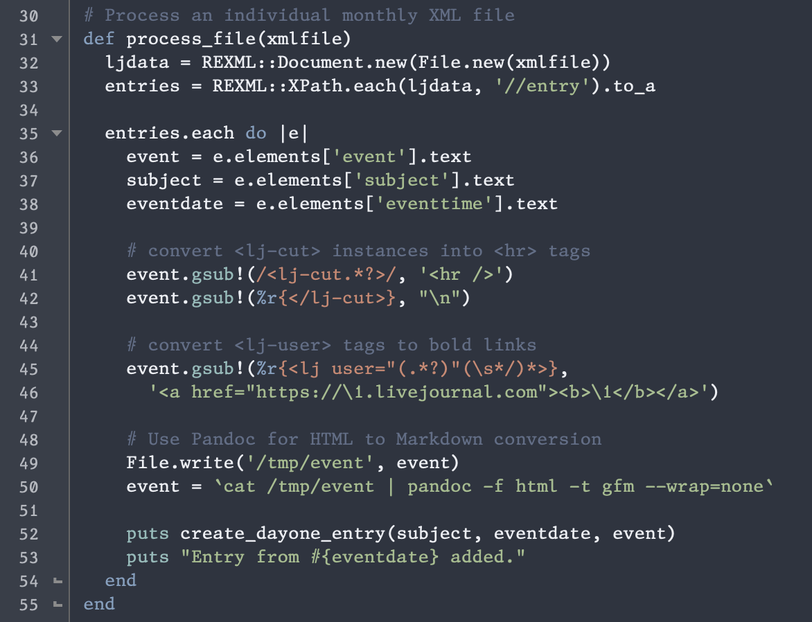

# Nord color scheme for BBEdit

An arctic, north-bluish clean and elegant BBEdit theme, based on the [Nord color palette][1].

[1]: https://www.nordtheme.com/

<figure>

<figcaption>Nord for BBEdit</figcaption>
</figure>

## Getting Started

### Installation

Put the `Nord.bbColorScheme` file in BBEdit's "Color Schemes" support folder. (You can get there by choosing the folder name from the "Folders" submenu on the BBEdit application menu.)

### Activation

Open BBEdit's preferences and go to the Appearances pane. Select "Nord" as the editor color scheme and select "Dark" for the application appearance.

Note that BBEdit will let you select different default color schemes for light and dark system appearances. To set Nord as your Dark theme, follow the instructions above, then select "Light" for the application appearance and choose an appropriate theme. If you then select "Use system appearance" for application appearance, BBEdit will switch themes automatically when the system switches from light to dark.

## Version History

- 2022-05-06: 1.0.0 - Initial release
- 2022-05-06: 1.0.1 - Tweak highlight colors

## Copyright and etc.

The BBEdit port is Copyright 2022 Watts Martin, licensed under the MIT License (see accompanying file for details). Nord is Copyright 2016 Arctic Ice Studio and Sven Greb, licensed under the MIT License.
